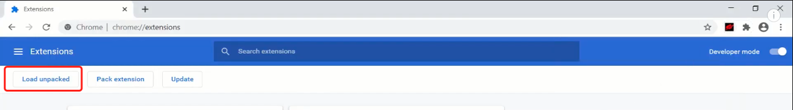
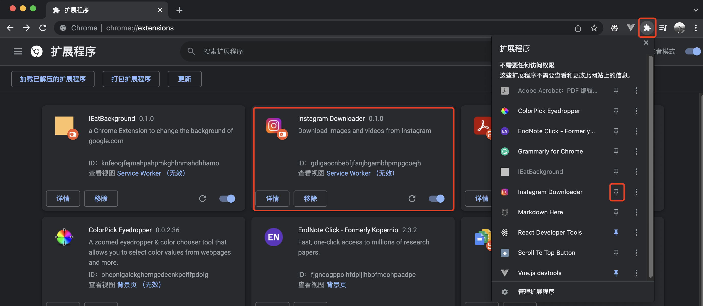
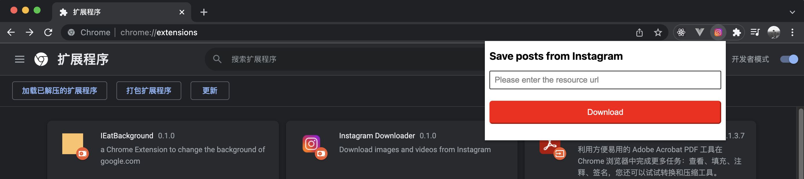
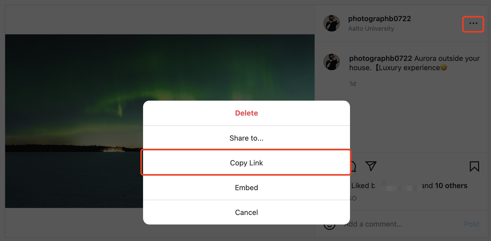

# Description

It is a simple chrome browser extension that allows you to download images and videos from Instagram using urls.

# Usage
1. Clone this repo
`
$ git clone https://github.com/HaibiPeng/instagram-save-ext.git
`
2. Go to [chrome://extensions/](chrome://extensions/) and click **Load unpacked**

3. Upload the dist folder and pin the extension

4. Then you will see the icon and click on it

5. Go to the post you like on Instagram and copy the link

6. Paste the link in the downloader and click Download, then you will see the pictures and videos in the default downloading directory of your Chrome browser.
